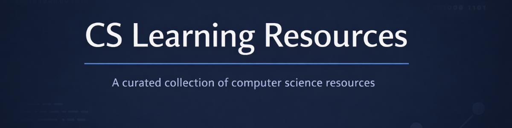

# 

# CS Learning Resources
A structured, high-quality index of learning resources for Computer Science students.


---

## Overview

**CS Learning Resources** is a curated and continuously evolving collection of **reliable external resources** for studying Computer Science.

The repository is designed to provide a **clean, structured entry point** to core CS topics, avoiding low-quality material and unnecessary duplication.

It is intended for:
- Computer Science students
- Self-learners following an academic-style path
- Developers strengthening fundamentals

This project does **not** host original educational content.  
It serves as a **carefully selected index** of books, courses, notes, exercises, tools, and repositories chosen for clarity and long-term value.

---

## How to Use This Repository

- Navigate by topic according to what you want to study
- Each topic is divided into logical subsections such as:
  - theory
  - exercises
  - projects
  - tools
- Resources include short descriptions and contextual notes when necessary

The repository is meant to be **revisited over time** as knowledge progresses.

---

## Organization Strategy

Resources are organized by **core Computer Science domains**.

Each domain may include:
- learning material
- practice exercises
- reference repositories
- applied project ideas

All entries follow a **consistent and minimal format** to ensure readability and easy comparison between resources.

---

## Foundational & Core Topics

### Programming Fundamentals

#### C Programming

- **Exercises**
    - **CS50 – C Problem Sets**  
      Official Harvard CS50 problem sets focused on problem-solving, memory management,
      and low-level reasoning using C.  
      https://cs50.harvard.edu/x/

    - **K. N. King – Companion Exercises (Unofficial Solutions Repo)**  
      Exercises inspired by *C Programming: A Modern Approach*, with community solutions.  
      https://github.com/SuperMoudy/C-programming-A-Modern-Approach-2nd-ed-Solutions
      
    - **Exercism – C Track**  
      A structured set of C exercises with tests, designed for progressive learning and practice.  
      Great for practicing core concepts and building problem-solving skills.  
      https://github.com/exercism/c

    - **C Practice Problems**  
      Repository with multiple beginner and intermediate exercises for practicing C.  
      https://github.com/TheRenegadeCoder/sample-programs/tree/main

    - **Extra Practice**  
      Basic C exercises covering variables, loops, arrays, matrices, strings, pointers, and file I/O.  
      Each exercise is self-contained, without explanations, ideal for raw practice.  
      https://github.com/miglioDev/c-basic


- **Learning Material**
    - **Beej’s Guide to C Programming**  
      A clear and beginner-friendly guide to C, focused on practical understanding
      rather than theory alone.  
      https://beej.us/guide/bgc/

    - **C Programming – Wikibook**  
      A concise and well-structured reference covering core C concepts,
      useful both for learning and revision.  
      https://en.wikibooks.org/wiki/C_Programming

- **Others GitHub Repositories**
    - **Awesome C**  
      A curated list of high-quality C libraries, tools, books, and educational resources.  
      https://github.com/oz123/awesome-c

    - **db_tutorial (Build Your Own SQLite)**  
      A project-based tutorial that walks through building a simple database engine in C,
      excellent for systems-level understanding.  
      https://github.com/cstack/db_tutorial

### Algorithms & Data Structures

- **Learning & Practice**
    - **Algorithms, Part I & II (Princeton)**  
      Comprehensive theoretical foundation with practical implementations in Java.  
      https://algs4.cs.princeton.edu/

- **GitHub Repositories**
    - **The Algorithms**  
      Open-source implementations of algorithms across multiple languages,  
      organized and well-maintained for learning and reference.  
      https://github.com/TheAlgorithms

    - **JavaScript Algorithms**  
      Algorithms and data structures implemented in JavaScript, with clear explanations.  
      https://github.com/trekhleb/javascript-algorithms

    - **Interactive Coding Challenges**  
      120+ interactive coding problems with solutions in Python, ideal for practice.  
      https://github.com/donnemartin/interactive-coding-challenges

- **Problem Sets**
    - **LeetCode**  
      Popular platform for practicing data structures, algorithms, and coding interview problems.  
      https://leetcode.com/

### Mathematics for Computer Science

- **Learning Material**
    - **MIT 6.042J: Mathematics for Computer Science**  
      Full course on discrete mathematics and probability tailored for computer science, with lecture notes, assignments, and resources from MIT OpenCourseWare.  
      https://ocw.mit.edu/courses/6-042j-mathematics-for-computer-science-spring-2015/

    - **Discrete Mathematics (GitBook)**  
      Online structured guide covering logic, sets, functions, relations, proofs, graphs, and discrete probability — foundational for CS.  
      https://discretemaths.github.io/

- **GitHub Repositories**
    - **Programming, Math & Science Resources**  
      Curated list of free learning materials linking to programming, mathematics, and science content, including math for CS topics.  
      https://github.com/bobeff/programming-math-science

    - **Lehman Math CS Resources**  
      Community repository with resources and solutions related to the *Mathematics for Computer Science* course content (book/course materials).  
      https://github.com/lair001/lehman-math-cs
---

## Systems & Infrastructure

### Operating Systems & Systems Programming

- **Learning Material**
    - **OSTEP – Operating Systems: Three Easy Pieces**  
      One of the most respected open textbooks on operating systems. Covers processes, scheduling, memory, file systems, virtualization, and more.  
      https://pages.cs.wisc.edu/~remzi/OSTEP/

    - **Linux Kernel Newbies**  
      A community resource with guides, tutorials, and FAQs for understanding the Linux kernel and OS internals.  
      https://kernelnewbies.org/
      
    - **The Linux Programming Interface – Online Resources**  
      Companion site for TLPI, with examples and clarifications on Linux system calls and low-level APIs.  
      https://man7.org/tlpi/

    - **Advanced Programming in the UNIX Environment (APUE)**  
      Classic reference for UNIX/POSIX system programming concepts and patterns.  
      https://stevens.netmeister.org/631/

    - **Linux From Scratch (LFS)**  
      Step-by-step guide to building a Linux system from source, ideal for understanding OS internals.  
      https://www.linuxfromscratch.org/

    - **OSDev Wiki**  
      Practical wiki for learning operating system development from scratch (bootloaders, kernels, drivers).  
      https://wiki.osdev.org/

    - **Linux Kernel Source**  
      Official mirror of the Linux kernel source code. Useful for real-world OS exploration.  
      https://github.com/torvalds/linux

    - **minix**  
      Educational microkernel-based operating system, historically influential for OS research.  
      https://github.com/Stichting-MINIX-Research-Foundation/minix

---

### Computer Architecture

- **Learning Material**
    - **Nand2Tetris (The Elements of Computing Systems)**  
      A foundational course that walks from logic gates to a working OS and compiler — deep insights into computer architecture and systems thinking.  
      https://www.nand2tetris.org/

    - **Ripes – Visual Computer Architecture Simulator**  
      An interactive visual simulator for computer architecture concepts (pipelining, memory, control logic).  
      https://github.com/mortbopet/Ripes
      
    - **CS61C – Great Ideas in Computer Architecture (UC Berkeley)**  
      Strong focus on RISC-V, performance, memory hierarchy, and low-level reasoning.  
      https://cs61c.org/
  
    - **MIT 6.004 – Computation Structures**  
      Comprehensive course covering digital logic, processor design, pipelining, and memory systems.  
      https://computationstructures.org/
      
    - **computer-architecture-exercises**  
      Collection of foundational computer architecture exercises with clear explanations (binary operations, encoding, digital-circuits).  
      https://github.com/miglioDev/computer-architecture-exercises

### Networking

- **Learning Material**
    - **Computer Networking: A Top-Down Approach (Kurose & Ross)**  
      Companion site for one of the most widely used computer networking textbooks.  
      Contains lecture slides, exercises, and supplemental resources.  
      https://gaia.cs.umass.edu/kurose_ross/index.htm

    - **Stanford CS144 – Introduction to Computer Networking**  
      Stanford’s course materials covering fundamentals of networking, protocols, and socket programming.  
      https://cs144.github.io/

    - **Beej’s Guide to Network Programming**  
      Classic tutorial focused on socket programming in C (TCP/UDP).  
      https://github.com/beejjorgensen/networking_guides
      
    - **The TCP/IP Guide**  
      Deep and structured reference covering the entire TCP/IP stack.  
      http://www.tcpipguide.com/
      
    - **Practical Networking**  
      Clear, engineer-oriented explanations of core networking concepts (TCP, IP, routing, NAT, DNS).  
      https://www.practicalnetworking.net/
---

### Databases

- **Learning Material**
    - **CMU 15-445 / 15-721 – Database Systems**  
      Carnegie Mellon University’s in-depth course covering database internals, query processing, transaction management, and concurrency control.  
      https://15445.courses.cs.cmu.edu/

    - **Database System Concepts – Companion Materials**  
      Open course resources and exercises aligned with the classic textbook *Database System Concepts* (Korth & Silberschatz).  
      Covers relational databases, indexing, query optimization, and storage engines.  
      https://db-book.com/

    - **Stanford CS245 – Database Systems**  
      Lecture notes and materials from Stanford’s database systems course, focused on implementation and internals.  
      https://web.stanford.edu/class/cs245/
      
    - **Use The Index, Luke!**  
      Practical, engineer-friendly guide to indexing, query performance, and SQL optimization.  
      https://use-the-index-luke.com/
      
    - **postgresql**  
      Full-featured open-source relational database showcasing real-world query planning, MVCC, and storage engines.  
      https://github.com/postgres/postgres

---

## Specialized Domains

### Machine Learning & AI

- **Foundational Courses**
    - **Machine Learning (Andrew Ng)**  
      Foundational course for ML concepts and intuition.  
      https://www.coursera.org/learn/machine-learning

- **GitHub Repositories**
    - **Machine Learning Tutorials**  
      Machine learning tutorials, examples, and articles.  
      https://github.com/ujjwalkarn/Machine-Learning-Tutorials
    - **Practical Deep Learning for Coders**  
      Course materials for fast.ai courses.  
      https://github.com/fastai/fastbook

### Web Development

- **GitHub Repositories**
    - **Awesome Web Development**  
      A curated list of awesome Web Development tools, libraries, and resources.  
      https://github.com/mrmartineau/awesome-web-dev-resources
    - **Frontend Development**  
      A list of helpful front-end related tools, frameworks, and resources.  
      https://github.com/RitikPatni/Front-End-Web-Development-Resources

### Software Engineering Practices

- **GitHub Repositories**
    - **Clean Code**  
      Clean Code concepts adapted for various programming languages.  
      https://github.com/ryanmcdermott/clean-code-javascript
    - **System Design Primer**  
      Learn how to design large-scale systems.  
      https://github.com/donnemartin/system-design-primer
    - **Design Patterns**  
      Design patterns implemented in various languages.  
      https://github.com/faif/python-patterns

---

## Practical Skills & Projects

### Project Ideas

- **GitHub Repositories**
    - **Build Your Own X**  
      Collection of project ideas to learn systems and software internals.  
      https://github.com/codecrafters-io/build-your-own-x
    - **Project-based Learning**  
      Curated list of project-based tutorials.  
      https://github.com/practical-tutorials/project-based-learning
    - **App Ideas**  
      Collection of application ideas for developers to build and improve their coding skills.  
      https://github.com/florinpop17/app-ideas

### Interview Preparation

- **GitHub Repositories**
    - **Tech Interview Handbook**  
      Carefully curated content to help you ace your technical interviews.  
      https://github.com/yangshun/tech-interview-handbook
    - **Coding Interview University**  
      Complete computer science study plan to become a software engineer.  
      https://github.com/jwasham/coding-interview-university
    - **Interview Questions**  
      Interview questions for various companies and topics.  
      https://github.com/DopplerHQ/awesome-interview-questions

### Tools & Utilities

- **GitHub Repositories**
    - **Awesome Tools**  
      Curated list of tools for developers.  
      https://github.com/cube-js/awesome-tools
    - **Developer Roadmap**  
      Roadmap to becoming a web developer in 2024.  
      https://github.com/kamranahmedse/developer-roadmap

### GitHub Learning Resources

- **GitHub Guides**
    - **GitHub Skills**  
      Learn GitHub through interactive courses.  
      https://skills.github.com/
    - **GitHub Education**  
      Resources and programs for students and educators.  
      https://education.github.com/
    - **Open Source Programs**  
      A list of open source programs and internships.  
      https://github.com/tapaswenipathak/Open-Source-Programs

---

## Resource Entry Template

Use the following template when adding a new resource:

```markdown
### Resource Name
- **Link:** [URL](https://example.com)
- **Type:** exercises / book / course / project / reference / tool
- **Description:** Brief description of what this resource offers and why it's valuable
- **Tags:** e.g., C, algorithms, beginner, systems, free
- **Notes:** (Optional) Any additional context or recommendations
